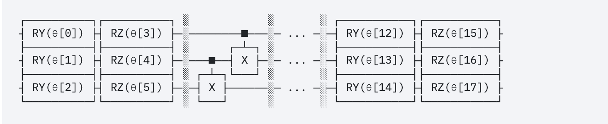

# VQE (Variational Quantum Eigensolver) Project


This repository contains the implementation of a custom made Variational Quantum Eigensolver (VQE) for finding the ground state energy of a given Hamiltonian by simulating the Heisenberg Spin Model using VQE with Random Circuit Ansatz. The VQE algorithm is a hybrid quantum-classical algorithm that leverages the power of quantum computers to solve optimization problems.

## Table of Contents

- [Problem Statement](#problem-statement)
- [Installation and Usage](#installation-and-usage)
- [Theory](#theory)
- [Project Work Description](#project-work-description)
- [Results](#results)
- [Contributing](#contributing)
- [License](#license)

## Problem Statement
- Calculating the ground state energy of the Heisenberg spin model using a custom made Variational Quantum Eigensolver. 
- The goal is to implement a VQE algorithm with a random circuit ansatz and study the accuracy obtained and time required for varying ansatz depth, as well as the impact of including or excluding two-qubit gates.

## Installation and Usage
To run the code and try out the VQE algorithm, you can either download the notebook **"SimulationUsingRandomCircuitAnsatz.ipynb"** and run it on a platform like IBM QuantumLab or if you prefer to run on a local machine in the form of a python script then follow the steps given below:

### Installation
1. Clone this repository to your local machine:
```bash
git clone https://github.com/ARaj-007/HeisnenbergSpinModelSimulator.git
```
2. Navigate to the project directory:
```bash
cd HeisnenbergSpinModelSimulator 
```
3. Install the required Python packages. You can use `pip` to install the dependencies from the `requirements.txt` file:
```bash
pip install -r requirements.txt
```
4. Navigate to the src folder and run the main script. Feel free to checkout all the src files.

You can also run the notebook given locally also but it is preferred to run it on the IBM Quantum Lab server.

## Theory
### Introduction
Quantum simulation, inspired by Richard Feynman's vision of using quantum systems to simulate other quantum systems, has emerged as a promising area of research in quantum computing.
The development of hybrid algorithms that combine quantum and classical computation has opened up new possibilities in quantum simulation. 

Among these algorithms, the Variational Quantum Eigensolver (VQE) has garnered significant attention for exploring the electronic structures of atoms and molecules through the Rayleigh-Ritz variational principle.By employing a parameterized quantum circuit, VQE aims to approximate the ground state of molecular Hamiltonians, enabling theoretical chemists to study reaction rates, molecular stability, and spectroscopic properties.


### Ground State energy 

The ground state energy of a molecule is a crucial property that becomes increasingly challenging to compute as the molecule's size grows. Currently, the largest molecule that has been successfully simulated is Beryllium Hydride. As molecules get larger, the complexity of molecular simulations grows exponentially. These simulations find applications in various fields, including drug discovery.

For the purposes of this project, I have considered a rather simple model H2.

## Steps Involved
The variational principle states that the energy of any trial wave function is always greater than or equal to the exact ground state energy of the system. In Chemistry,the minimum eigenvalue of a matrix represents the ground state energy of a Hermitian matrix.

1. We map the molecular Hamiltonians into qubit Hamiltonians.
There are various mapping schemes available like 'jordan_wigner', 'bravyi_kitaev', etc. I have used 'ParityMapper" here.

**ParityMapper** is an effective mapping technique used in quantum chemistry to convert the complex electronic structure problems of molecules into qubit representations suitable for quantum simulations. By exploiting spatial and spin symmetries, it efficiently groups similar electronic states together, reducing the number of qubits required. This approach enables quantum computers to simulate small to moderately-sized molecules, providing valuable insights into ground state energies, electronic structures, and reaction dynamics. 

2. Generating a Random circuit Ansatz

The expectation value of any wave function will be at least the minimum eigenvalue associated with the wave function.
The ground state of the Hamiltonian system is the smallest eigenvalue associated with the Hermitian matrix

3. Optimizing the Paramters
This stop involves defining the cost function that will be given as the objective funtion to the optimizer.We have used the statevecor_simulator as the backend for our quantum instance.
We have used the **COBYLA** optimizer for this project.
**COBYLA** is a derivative-free optimization algorithm widely used in quantum computing and variational algorithms like VQE (Variational Quantum Eigensolver). It belongs to the family of direct-search methods and is particularly well-suited for problems with constraints. In VQE, COBYLA helps find the optimal parameters for a parameterized quantum circuit to minimize the energy expectation value of a given quantum Hamiltonian. Unlike gradient-based methods, COBYLA doesn't require gradient information, making it suitable for noisy intermediate-scale quantum (NISQ) devices where precise gradients are challenging to compute.
## Project Work Description

Let's go through the notebook step by step and understand the functioning and reasoning behind each step.

Notebook is [here](https://github.com/ARaj-007/HeisnenbergSpinModelSimulator/blob/main/SimulationUsingRandomCircuitAnsatz.ipynb).

Here, we calculate the ground state energy for H2 using a noiseless simulator.

For our custom VQE, we will require the following libraries
```python
#The libraries that we will be using
import qiskit_nature
from qiskit.algorithms.minimum_eigensolvers import NumPyMinimumEigensolver
from qiskit_nature.second_q.formats.molecule_info import MoleculeInfo
from qiskit_nature.second_q.mappers import ParityMapper
qiskit_nature.settings.use_pauli_sum_op = False
from qiskit_nature.second_q.drivers import PySCFDriver
import matplotlib.pyplot as plt
import numpy as np
from qiskit import QuantumCircuit
from qiskit.circuit import Parameter
from qiskit import Aer, execute
from qiskit.algorithms.optimizers import SPSA, SLSQP, COBYLA
import time
```

- First we have to define the molecule. I have used qubit reduction as well to minimize the number of qubits required.
```python
# Defining the molecular information including atomic symbols, coordinates, multiplicity, and charge
molecule = MoleculeInfo(
    # Coordinates in Angstrom
    symbols=["H", "H"],  # Atomic symbols of the two hydrogen atoms
    coords=([0.0, 0.0, -0.3625], [0.0, 0.0, 0.3625]),  # Coordinates of the two hydrogen atoms
    multiplicity=1,  # Multiplicity of the molecule (1 for singlet)
    charge=0,  # Charge of the molecule (neutral charge)
)

# Create a PySCF driver to compute the molecular integrals
driver = PySCFDriver.from_molecule(molecule)

# Run the driver to obtain the electronic structure problem
problem = driver.run()

# Extract the second quantized operators representing the Hamiltonian
second_q_ops = problem.second_q_ops()

# Get the number of spatial orbitals and the number of particles in the system
num_spatial_orbitals = problem.num_spatial_orbitals
num_particles = problem.num_particles

# We are using ParityMapper to map the electronic structure problem to qubits, 
mapper = ParityMapper(num_particles=num_particles)


hamiltonian = second_q_ops[0]

# Performing two-qubit reduction
qubit_op = mapper.map(hamiltonian)
print(qubit_op)

```

    SparsePauliOp(['II', 'IZ', 'ZI', 'ZZ', 'XX'],
                  coeffs=[-1.05016043+0.j,  0.40421466+0.j, -0.40421466+0.j, -0.01134688+0.j,
      0.18037525+0.j])


```python
repulsion_energy = problem.nuclear_repulsion_energy# we will use this later to adjust the total energy
print(repulsion_energy)
```

    0.7298996012689656

- Next we define the function that will be used to generate the refernce value for the ground state energy. For this process, we use the NumPyMinimumEigensolver from the Qiskit.algorithms library.

```python
def exact_solver(qubit_op, problem):
    """
    Solves the quantum problem exactly using the NumPyMinimumEigensolver that will be
    used as reference for the results of the custom VQE

    Args:
        qubit_op (WeightedPauliOperator): The qubit operator representing the quantum problem.
        problem (ElectronicStructureProblem): The electronic structure problem containing
                                              information about the molecule and the Hamiltonian.

    Returns:
        dict: A dictionary containing the result of the exact solver.

    Raises:
        AlgorithmError: If an error occurs during the computation.
    """
    # Use NumPyMinimumEigensolver to compute the minimum eigenvalue
    sol = NumPyMinimumEigensolver().compute_minimum_eigenvalue(qubit_op)
    if sol is None:
        raise ValueError("Solver did not find a valid solution.")
    
    result = problem.interpret(sol)
    return result
```
## Important Functions
## Random_circuit_ansatz
This funnction generates a random ansatz depending on the number of qubits and the depths. A bool has been used to specify whether to include 2 qubit gates are to be applied or not. When set to true, it randomly applies the 2-qubit gates to pairs. 
Note we are randomly choosing the gates. For the case of two qubit gates as well, the function randomly adds CX gates between pairs of qubits with a 50% probability.
```python
def random_circuit_ansatz(num_qubits, depth, include_two_qubit_gates=True):
    """
    Generate a random quantum circuit ansatz.

    Args:
        num_qubits (int): The number of qubits in the circuit.
        depth (int): The depth of the circuit, i.e., the number of layers of gates.
        include_two_qubit_gates (bool): If True, include two-qubit gates in the circuit.

    Returns:
        QuantumCircuit: A randomly generated quantum circuit ansatz.

    Notes:
        This function generates a random quantum circuit ansatz with the specified number
        of qubits and depth. The circuit can include single-qubit gates (Hadamard, RX, RY, and RZ),
        and optionally, two-qubit gates (CX gates).

        The circuit is parameterized using Parameter objects, allowing for later optimization
        of the circuit's parameters.

        If include_two_qubit_gates is True, the function randomly adds CX gates between pairs
        of qubits with a 50% probability.

        The generated quantum circuit is returned for further use in VQE or other quantum algorithms.
    """
    circuit = QuantumCircuit(num_qubits)

    # Create parameter objects for the circuit parameters
    circuit_params = [[Parameter(f"theta_{d}_{q}") for q in range(num_qubits)] for d in range(depth)]

    for d in range(depth):
        for q in range(num_qubits):
            rand_gate = np.random.choice(['h', 'rx', 'ry', 'rz'])
            rand_param = circuit_params[d][q]  # Get the corresponding parameter object

            if rand_gate == 'h':
                circuit.h(q)
            elif rand_gate == 'rx':
                circuit.rx(rand_param, q)
            elif rand_gate == 'ry':
                circuit.ry(rand_param, q)
            elif rand_gate == 'rz':
                circuit.rz(rand_param, q)
        if include_two_qubit_gates:
            for qubit1 in range(num_qubits - 1):
                for qubit2 in range(qubit1 + 1, num_qubits):
                    if np.random.rand() < 0.5:
                        circuit.cx(qubit1, qubit2)

    return circuit
```

## Calculate_expectation
Here we have used the statevecor_simulator backend.
This is used to create the objective functionof the VQE.
```python
def calculate_expectation(circuit, params, hamiltonian):
    """
    Calculate the expectation value of a quantum circuit with respect to a given Hamiltonian.

    Args:
        circuit (QuantumCircuit): The quantum circuit to evaluate.
        params (numpy.ndarray): An array of parameter values to bind to the circuit.
        hamiltonian matrix : The Hamiltonian operator.

    Returns:
        float: The expectation value of the circuit with respect to the Hamiltonian.

    Notes:
        This function calculates the expectation value of a quantum circuit with respect to
        a given Hamiltonian. The circuit is parameterized using Parameter objects, and the
        provided parameter values are bound to the circuit before evaluation.

        The function simulates the quantum circuit on the statevector simulator backend
        and computes the expectation value using the statevector representation of the circuit's
        final state. The expectation value is calculated as the inner product between the
        statevector and the Hamiltonian operator.

        The function returns the total expected energy.

    Raises:
        QiskitError: If the circuit evaluation job fails or the Hamiltonian is invalid.
    """
    backend = Aer.get_backend('statevector_simulator')

    # Bind the provided parameter values to the circuit
    bound_circuit = circuit.bind_parameters({p: val for p, val in zip(circuit.parameters, params.flatten())})

    try:
        # Execute the bound circuit on the statevector simulator backend
        job = execute(bound_circuit, backend)
        result = job.result()
        statevector = result.get_statevector()
    except Exception as exc:
        raise QiskitError("Failed to evaluate the circuit on the statevector simulator!") from exc

    # Calculate the expectation value as the inner product between statevector and Hamiltonian
    expectation = np.vdot(statevector, np.dot(hamiltonian, statevector))
    return expectation.real

```

## my_vqe
I have used by own implementation of the VQE algorithm. It internally makes use of COBYLA optimizer though other optimizers can also be easily incorporated.

Note we are initializing the ansatz randomly within the function itself. The parameter initialization is completely random.

```python
def my_vqe(ansatz_circuit, qubit_op, max_iterations=100, tolerance=1e-4):
    """
    Perform the Variational Quantum Eigensolver (VQE) algorithm to find the ground state energy
    of a given Hamiltonian using a parameterized quantum circuit (ansatz).

    Args:
        ansatz_circuit (QuantumCircuit): The parameterized quantum circuit (ansatz) to prepare the quantum state.
        qubit_op (PauliSumOp | SparsePauliOp | BaseOperator): The Hamiltonian as a qubit operator for which
            the ground state energy is to be calculated.
        max_iterations (int, optional): The maximum number of iterations for the optimizer (default is 100).
        tolerance (float, optional): The convergence tolerance for the optimizer (default is 1e-4).

    Returns:
        tuple: A tuple containing the following elements:
            - numpy.ndarray: The optimal parameters for the ansatz circuit.
            - float: The final ground state energy obtained after VQE optimization.
            - float: The time taken for the VQE optimization.

    Note:
        The objective function of the COBYLA optimizer is defined internally to update the circuit,
        print intermediate energies in steps of 5, and return the intermediate energy during optimization.

    Example:
        num_qubits = 4
        depth = 3
        ansatz_circuit = random_circuit_ansatz(num_qubits, depth)
        params, final_energy, optimizer_time = my_vqe(ansatz_circuit, hamiltonian)
        print(f"Optimal parameters: {params}")
        print(f"Final ground state energy: {final_energy}")
        print(f"Optimizer time: {optimizer_time} seconds")
    """
    
    #Random initialization of the circuit parameters
    num_params = len(ansatz_circuit.parameters)
    params = random_params(num_params)
    circuit = assign_parameters(ansatz_circuit, params)
    hamiltonian = qubit_op.to_matrix()
    
    previous_energy = float('inf')

    optimizer = COBYLA(maxiter=max_iterations, tol=tolerance)

    # The objective function for the optimizer
    eval_count = 0
    def objective_function(p):
        nonlocal eval_count
        updated_circuit = assign_parameters(ansatz_circuit, p)
        intermediate_energy = calculate_expectation(updated_circuit, p, hamiltonian)
        eval_count += 1
        if eval_count%5 == 0:
            print(f"Iteration {eval_count}: Energy = {intermediate_energy}")
        return intermediate_energy

    start_time = time.time()
    result = optimizer.minimize(objective_function, x0=params)
    end_time = time.time()

    optimal_params = result.x
    final_energy = calculate_expectation(ansatz_circuit, optimal_params, hamiltonian)
    optimizer_time = end_time - start_time

    return params, final_energy, optimizer_time

```
- Next we test this implementation for 2 cases when only single qubit gates are used and when both single and 2 qubit gates are used. Here's an example:
```python
depths = np.arange(1, 30, 1)
times = []
vqe_energies = []
for dep in depths:
    var_form =  random_circuit_ansatz(qubit_op.num_qubits,dep, False)#No 2 qubit gates
    optimal_params, final_energy, total_time = my_vqe(var_form, qubit_op)
    vqe_result = final_energy + repulsion_energy #Adding the shift
    vqe_energies.append(vqe_result)
    times.append(total_time)
    print(
        f"Depth: {np.round(dep, 2)}",
        f"VQE Result: {vqe_result:.5f}",
        f"Time: {total_time:.3f} seconds",
    )
```
To test the effect of depths I have also tested out the EffientSU2 ansatz using Qiskit library's functions - Estimator class for the expectation value and the VQE algorithm. Its results have also been recorded.
### EfficientSU2
The EfficientSU2 circuit consists of layers of single qubit operations spanned by SU(2) and 
 entanglements. This is a heuristic pattern that can be used to prepare trial wave functions for variational quantum algorithms or classification circuit for machine learning.

SU(2) stands for special unitary group of degree 2, its elements are 2 x 2 unitary matrices with determinant 1, such as the Pauli rotation gates.


## Estimator
The Estimator class in Qiskit is a tool for estimating the expectation values of observables over quantum circuits. It can be used to estimate the expectation values of both classical and quantum observables.

The Estimator class takes a number of parameters, including the following:

- Circuits: A list of quantum circuits.
- Observables: A list of observables.
- Parameter values: A list of lists of parameters.
- Backend: The backend to use for running the circuits.
- Run options: A dictionary of runtime options.

## VQE
Variational Quantum Eigensolver (VQE) is a hybrid quantum-classical algorithm for finding the ground state energy of a Hamiltonian. It works by iteratively optimizing a classical variational circuit to minimize the energy of the Hamiltonian.

The VQE algorithm is implemented in the VQE class in the Qiskit library. The VQE class takes a number of parameters, including the following:

- Hamiltonian: The Hamiltonian to be solved.
- Variational circuit: The variational circuit to be optimized.
- Optimizer: The optimizer to be used for optimizing the variational circuit.
- Backend: The backend to use for running the circuits.
- Run options: A dictionary of runtime options.
The VQE class then iteratively optimizes the variational circuit to minimize the energy of the Hamiltonian. The results are returned as an VQEResult object.

The VQEResult object contains the following information:

- Energy: The ground state energy of the Hamiltonian.
- Variance: The variance of the ground state energy.
- Iterations: The number of iterations used to optimize the variational circuit.
- Warnings: A list of warnings that were encountered.

```python
# Now lets see the results using EfficientSU2 and the VQE algorithm from the Qiskit Library
# We will also make use of Estimator to calculate the expectation value
from qiskit_aer.primitives import Estimator
from qiskit.algorithms.minimum_eigensolvers import VQE
from qiskit.circuit.library import EfficientSU2

depths_3 = np.arange(1, 30, 1)
times_3 = []
vqe_energies_3 = []
noiseless_estimator = Estimator(approximation=True)
optimizer = COBYLA(maxiter=100, tol = 1e-4)
for dep in depths_3:
    var_form = EfficientSU2(qubit_op.num_qubits, entanglement="linear", reps = dep)
    start_time = time.time()
    vqe = VQE(noiseless_estimator, var_form, optimizer)
    vqe_calc = vqe.compute_minimum_eigenvalue(qubit_op)
    end_time = time.time()
    vqe_result = problem.interpret(vqe_calc).total_energies[0].real
    vqe_energies_3.append(vqe_result)
    total_time = end_time - start_time
    times_3.append(total_time)
    print(f"Depth {dep}: VQE_Result = {vqe_result}: Time {total_time}")
```
# Results
Now lets take a look at the results of the various cases.
## Without 2 qubit gates
.png)
.png)

The results are close but never equal to correct value. In my multiple rounds of execution, I found that the depth had little effect and the results were more or less close. In the particular execution for which the plot is shown,for a few inital depths, the guesses are off but afterwords they remain more or less conisitent.
## With 2 qubit gates(randomly applied)
.png)
.png)

In this case, in the many executions that I conducted, I found there were more number of correct VQE rresults, while for few inital depths the results were off.

Note, we were randomly applying the 2 qubit gates with 50 percent probability, so that could also have an impact here.
In general, the results were more accurate.

## EfficientSU2
.png)
.png)

In this case, for the initial Depths, the results were very accurate, however after certain number of depths we can see that the results began to deviate.

In all the cases, more or less, optimization time increased with Depth.

## Conclusion
We generated a random circuit ansatz, defined our custom expectation value function and a custom VQE implementation. We saw the impact of including 2 qubit gates as well the results of the EfficientSU2(using Estimator and Qiskit's VQE). In conclusion, applying the 2 qubit gates did increase the accuracy of the final answers, however there were off guesses as well. This could also be due to the fact of random application of 2 qubit gates as well as the imapct of initializing the ansatz completely randomly (i.e no particluar inital state like the HartreeFock State). On the other hand, EfficientSU2 gave great results for inital few reps(depths), but later began to diverge suggesting the adverse impact of too many paramters to optimize. 
Overall, it was a great learning and research experience and there is immense potenial to further optimize this implementation.

## Contributing
This project is open to any suggestions and contribution from interesed parties.

If you find any issues or want to contribute to this project, feel free to open a pull request or submit an issue.

## License
This project is licensed under the MIT License. Feel free to use and modify the code as per the terms of the license.