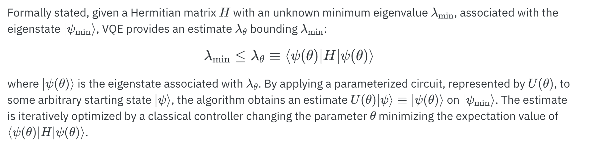

# VQE (Variational Quantum Eigensolver) Project


This repository contains the implementation of a custom made Variational Quantum Eigensolver (VQE) for finding the ground state energy of a given Hamiltonian by simulating the Heisenberg Spin Model using VQE with Random Circuit Ansatz. The VQE algorithm is a hybrid quantum-classical algorithm that leverages the power of quantum computers to solve optimization problems.

## Table of Contents

- [Problem Statement](#problem-statement)
- [Installation and Usage](#installation-and-usage)
- [Theory](#theory)
- [Project Work Description](#project-work-description)
- [Results](#results)
- [Contributing](#contributing)
- [License](#license)

## Problem Statement
- Calculating the ground state energy of the Heisenberg spin model using a custom made Variational Quantum Eigensolver. 
- The goal is to implement a VQE algorithm with a random circuit ansatz and study the accuracy obtained and time required for varying ansatz depth, as well as the impact of including or excluding two-qubit gates.

## Installation and Usage
To run the code and try out the VQE algorithm, you can either download the notebook "SimulationUsingRandomCircuitAnsatz.ipynb" and run it on a platform like IBM QuantumLab or if you prefer to run on a local machine in the form of a python script then follow the steps given below:

### Installation
1. Clone this repository to your local machine:
```bash
git clone https://github.com/ARaj-007/HeisnenbergSpinModelSimulator.git
```
2. Navigate to the project directory:
```bash
cd HeisnenbergSpinModelSimulator 
```
3. Install the required Python packages. You can use `pip` to install the dependencies from the `requirements.txt` file:
```bash
pip install -r requirements.txt
```
4. Navigate to the src folder and run the main script. Feel free to checkout all the src files.

You can also run the notebook given locally also but it is preferred to run it on the IBM Quantum Lab server.

## Theory
### Introduction
Quantum simulation, inspired by Richard Feynman's vision of using quantum systems to simulate other quantum systems, has emerged as a promising area of research in quantum computing.
The development of hybrid algorithms that combine quantum and classical computation has opened up new possibilities in quantum simulation. 

Among these algorithms, the Variational Quantum Eigensolver (VQE) has garnered significant attention for exploring the electronic structures of atoms and molecules through the Rayleigh-Ritz variational principle.By employing a parameterized quantum circuit, VQE aims to approximate the ground state of molecular Hamiltonians, enabling theoretical chemists to study reaction rates, molecular stability, and spectroscopic properties.


### Ground State energy 

The ground state energy of a molecule is a crucial property that becomes increasingly challenging to compute as the molecule's size grows. Currently, the largest molecule that has been successfully simulated is Beryllium Hydride. As molecules get larger, the complexity of molecular simulations grows exponentially. These simulations find applications in various fields, including drug discovery.

For the purposes of this project, I have considered a rather simple model H2.

## Steps Involved
The variational principle states that the energy of any trial wave function is always greater than or equal to the exact ground state energy of the system. In Chemistry,the minimum eigenvalue of a matrix represents the ground state energy of a Hermitian matrix.

1. We map the molecular Hamiltonians into qubit Hamiltonians.
There are various mapping schemes available like 'jordan_wigner', 'bravyi_kitaev', etc. I have used 'ParityMapper" here.

**ParityMapper** is an effective mapping technique used in quantum chemistry to convert the complex electronic structure problems of molecules into qubit representations suitable for quantum simulations. By exploiting spatial and spin symmetries, it efficiently groups similar electronic states together, reducing the number of qubits required. This approach enables quantum computers to simulate small to moderately-sized molecules, providing valuable insights into ground state energies, electronic structures, and reaction dynamics. 

2. Generating a Random circuit Ansatz

## Project Work Description

Let's go through the notebook step by step and understand the functioning and reasoning behind each step.

Notebook is [here](https://github.com/ARaj-007/HeisnenbergSpinModelSimulator/blob/main/SimulationUsingRandomCircuitAnsatz.ipynb).

Here, we calculate the ground state energy for H2 using a noiseless simulator.

For our custom VQE, we will require the following libraries
```python
#The libraries that we will be using
import qiskit_nature
from qiskit.algorithms.minimum_eigensolvers import NumPyMinimumEigensolver
from qiskit_nature.second_q.formats.molecule_info import MoleculeInfo
from qiskit_nature.second_q.mappers import ParityMapper
qiskit_nature.settings.use_pauli_sum_op = False
from qiskit_nature.second_q.drivers import PySCFDriver
import matplotlib.pyplot as plt
import numpy as np
from qiskit import QuantumCircuit
from qiskit.circuit import Parameter
from qiskit import Aer, execute
from qiskit.algorithms.optimizers import SPSA, SLSQP, COBYLA
import time
```

First we have to define the molecule.
